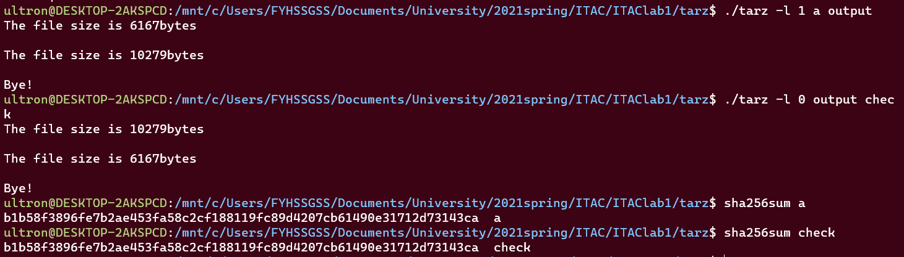
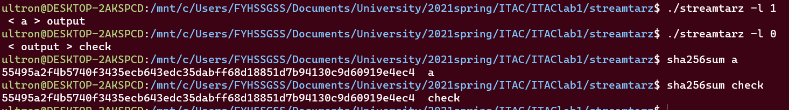

# tarz&streamtarz

## background

A simple program which supported huffman compressing and decompressing,LZ78 compressing and decompressing.There are two modes under the project, one is based on file read and write compression, one is based on standard input and output stream compression and decompression.

## install&build

### Install  Boost

```shell
wget http://sourceforge.net/projects/boost/files/boost/1.54.0/boost_1_54_0.tar.gz
tar -xzvf boost_1_54_0.tar.gz
cd boost_1_54_0
sudo ./bootstrap.sh --prefix=/usr/local
sudo ./b2 install --with=all
```

>**Error while loading shared libraries Error while loading shared libraries**:
>
>```shell
>sudo vim /etc/ld.so.conf
># add "/usr/local/lib" to the end of the file
>cd /etc
>ldconfig  
>```
>
>Problem solved.

### build

Running on a Linux environment

- tarz

  ```shell
  cd tarz
  g++ CLI.cpp -lboost_program_options -o tarz
  ```

- streamtarz

  ```shell
  cd streamtarz
  g++ streamCLI.cpp -lboost_program_options -o streamtarz
  ```

## usage

### tarz

Use `./tarz -h`to see help below.

```shell
 ./tarz -h
all options:
  -g [ --gaf ] arg       Use Huffman encoding to compress (1)/ decompress (0)
                        the input file path   the output file path
  -l [ --lz78 ] arg     Use LZ78 encoding to compress (1)/ decompress (0)   the
                        input file path   the output file path
  -h [ --help ]
```

For example, if we want to use LZ78 to compress a file, decompress it and test the correctness.



### streamtarz

Use `./streamtarz -h` to see help below.

```shell
./streamtarz -h
all options:
  -g [ --gaf ] arg      Use Huffman encoding to compress (1)/ decompress (0)
  -l [ --lz78 ] arg     Use LZ78 encoding to compress (1)/ decompress (0)
  -h [ --help ]         
```

For example, if we want to use LZ78 to compress a file, decompress it and test the correctness ,for ease of comparison, we redirect the standard input-output stream to files.



## Maintainers

@FYHSSGSS

